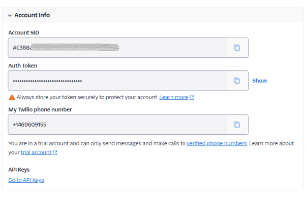
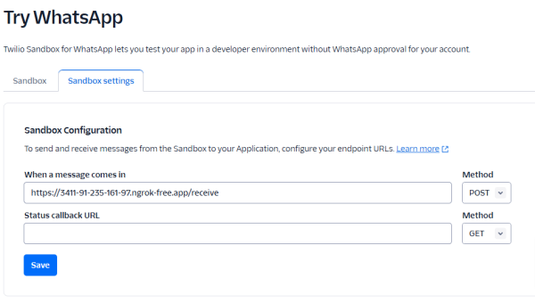
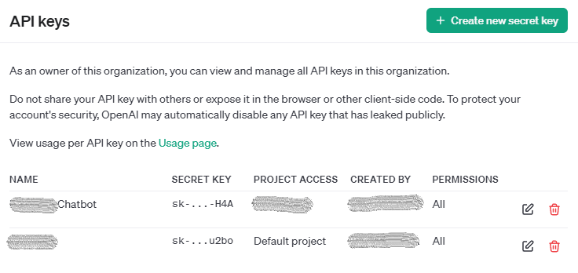

# How to create your Own AI Bot on WhatsApp Using an ABP.io Template

This article demonstrates how to build a WhatsApp bot that uses ChatGPT’s conversational AI by integrating an ABP.io application template with Twilio and the OpenAI API. Through this setup, you will create a real-time interactive WhatsApp bot that leverages ChatGPT's advanced language processing capabilities to respond to user messages. This tutorial includes essential steps for configuring the ABP.io project template, setting up Twilio for WhatsApp messaging, and connecting to OpenAI’s API, enabling a powerful AI-driven communication tool on WhatsApp.

## Set Up the ABP.io Project

**Install ABP Studio**: Download and install ABP Studio from [ABP Studio](https://abp.io/studio).

**Create New Solution**: Select a solution template, specifically the "Application (Layered)" template.

**Complete the Setup**: Follow the prompts to complete the project setup.


## Configure Twilio Account for WhatsApp Sandbox

**Sign Up for Twilio**: Register for a Twilio account if you don’t have one.

**Activate WhatsApp Sandbox**: In Twilio Console, navigate to Messaging > Try it Out > Send a WhatsApp message. Follow the provided instructions to join the WhatsApp Sandbox.

**Generate API Credentials**: Obtain your Twilio Account SID and Auth Token for API integration.



**Set Up Webhook URL for Sandbox**: Configure the “When a message comes in” webhook URL under Sandbox for WhatsApp in Twilio Console to point to your ABP application endpoint.



## Set Up OpenAI API (ChatGPT)

**Sign Up for OpenAI**: Register an account at OpenAI and retrieve an API key for ChatGPT.



## Develop API Endpoints in ABP Application

Add Twilio and OpenAI keys to **appsettings.json**

```json
"Twilio": {
  "AccountSid": "Your_Account_Sid_Here",
  "AuthToken": "Your_Auth_Token_Here",
  "WhatsAppNumber": "whatsapp:+14155278883",
  "ContentTemplateSid": "Your_Content_Template_Sid_Here"
},
"OpenAI": {
  "ApiUrl": "https://api.openai.com/v1/chat/completions",
  "ApiKey": "Your_OpenAI_Api_Key_Here"
}
```

Install Twilio REST API helper library from [Nuget](https://github.com/twilio/twilio-csharp)

### Key Classes and Their Functions:

**OpenAiAppService**

Purpose: Handles interactions with the OpenAI API, sending message threads to ChatGPT and receiving responses.
```cs
public class OpenAiAppService : ProjectAppService, IOpenAiAppService, ITransientDependency
{
    // Private fields to store API URL, API Key, and HTTP client instance

    private readonly string _apiUrl;
    private readonly string _apiKey;
    private readonly HttpClient _httpClient;

    // Constructor to initialize OpenAiAppService with configuration and HTTP client

    public OpenAiAppService(IConfiguration config, HttpClient httpClient)
    {

        // Get API URL from configuration; throw an exception if not found
        _apiUrl = config["OpenAI:ApiUrl"] ?? throw new ArgumentNullException(nameof(config), "API URL cannot be null");

        // Get API Key from configuration; throw an exception if not found
        _apiKey = config["OpenAI:ApiKey"] ?? throw new ArgumentNullException(nameof(config), "API Key cannot be null");

        // Initialize HTTP client and set the Authorization header with the API Key
        _httpClient = httpClient;
        _httpClient.DefaultRequestHeaders.Add("Authorization", $"Bearer {_apiKey}");
    }


    // Method to send a message thread to ChatGPT and get a response

    public async Task<string> AskChatGpt(List<OpenAiThreadCacheDetails> messagesThread)
    {
        // Define the request content for the OpenAI API call

        var requestContent = new
        {

            model = "gpt-4o",  // Model to use (e.g., GPT-4)
            messages = messagesThread.Select(s => new { role = s.Role, content = s.Message }).ToArray(),  // Format message thread
            temperature = 1,  // Set temperature for response randomness
            max_tokens = 2048,  // Limit the response length
            top_p = 1,  // Controls diversity via nucleus sampling
            frequency_penalty = 0,  // Reduce repetitive word use
            presence_penalty = 0,  // Encourage topic diversity
            response_format = new
            {
                type = "text"  // Specify text response format
            }
        };

        // Send POST request to OpenAI API
        var response = await _httpClient.PostAsJsonAsync(_apiUrl, requestContent);

        // Deserialize the response content
        var result = await response.Content.ReadFromJsonAsync<JsonDocument>();

        // Extract the response text; return a default message if no content is found
        var reply = result?.RootElement.GetProperty("choices")[0].GetProperty("message").GetProperty("content").GetString() ?? "No idea!";

        return reply;
    }
}
```


**OpenAiThreadCacheDetails**

Purpose: Represents individual messages in a conversation thread, storing details for caching and reuse.

```csharp
public class OpenAiThreadCacheDetails
{
    // The role of the message sender (e.g., "user" or "assistant")
    public required string Role { get; set; }

    // The content of the message in the thread
    public required string Message { get; set; }
}
```

**WhatsAppService**

Purpose: Manages communication between WhatsApp and ChatGPT by interacting with Twilio and OpenAI services.

```csharp
public class WhatsAppService : ProjectAppService, IWhatsAppService, ITransientDependency
{
    // Private fields for Twilio credentials, WhatsApp number, content SID, cache, and OpenAI service

    private readonly string _accountSid;
    private readonly string _authToken;
    private readonly string _fromNumber;
    private readonly string _contentSid;
    private readonly IDistributedCache<List<OpenAiThreadCacheDetails>> _cache;
    private readonly IOpenAiAppService _openAiAppService;

    // Constructor to initialize WhatsAppService with configuration and dependencies

    public WhatsAppService(IConfiguration config, IOpenAiAppService openAiAppService, IDistributedCache<List<OpenAiThreadCacheDetails>> cache)
    {
        // Retrieve Twilio credentials and WhatsApp number from configuration
        _accountSid = config["Twilio:AccountSid"] ?? throw new ArgumentNullException(nameof(config), "Twilio:AccountSid is not configured.");
        _authToken = config["Twilio:AuthToken"] ?? throw new ArgumentNullException(nameof(config), "Twilio:AuthToken is not configured.");
        _fromNumber = config["Twilio:WhatsAppNumber"] ?? throw new ArgumentNullException(nameof(config), "Twilio:WhatsAppNumber is not configured.");
        _contentSid = config["Twilio:ContentTemplateSid"] ?? throw new ArgumentNullException(nameof(config), "Twilio:ContentTemplateSid is not configured.");

        // Initialize Twilio client with account SID and auth token
        TwilioClient.Init(_accountSid, _authToken);

        // Assign the OpenAI service and cache dependencies
        _openAiAppService = openAiAppService;
        _cache = cache;

    }

    // Method to send a text message via WhatsApp using Twilio

    public async Task SendMessageAsync(string to, string message)
    {
        // Split the message into chunks if it exceeds a certain length
        var splittedText = SplitText(message);

        // Send each chunk of the message separately to avoid message length limits
        foreach (var text in splittedText)
        {

            await MessageResource.CreateAsync(

                from: new Twilio.Types.PhoneNumber(_fromNumber),

                to: new Twilio.Types.PhoneNumber(to),

                body: text

            );

        }
    }

    // Method to send a pre-defined template message via WhatsApp using Twilio

    public async Task SendTemplateMessageAsync(string to)
    {

        await MessageResource.CreateAsync(

            contentSid: _contentSid,

            from: new Twilio.Types.PhoneNumber(_fromNumber),

            to: new Twilio.Types.PhoneNumber(to)

        );
    }

    // Method to receive a message, generate a response using ChatGPT, and send the response back

    public async Task ReceiveMessageAsync(string from, string body)
    {

        // Get or initialize a cached conversation thread, adding the user's message
        var cacheMessages = await GetOrSetCacheMessagesThread(from, "user", body);
        
        // Ask ChatGPT for a response based on the message thread
        var chatGptAnswer = await _openAiAppService.AskChatGpt(cacheMessages);

        // Send ChatGPT's response back to the user on WhatsApp
        await SendMessageAsync(from, chatGptAnswer);
    }

    // Helper method to get or initialize a cached message thread for a user

    private async Task<List<OpenAiThreadCacheDetails>> GetOrSetCacheMessagesThread(string key, string role, string message)
    {
        // Attempt to retrieve the cached messages for the specified user
        var cacheMessages = await _cache.GetAsync(key);

        // If no cached messages are found, initialize with a new conversation including a system prompt
        if (cacheMessages == null)
        {
            cacheMessages = new List<OpenAiThreadCacheDetails>
            {
                new OpenAiThreadCacheDetails
                {
                    Role = "system",

                    Message = "You are a friendly and helpful assistant. Always provide clear, concise, and polite responses. Be attentive to the user’s questions, maintain a positive tone, and ensure your answers are accurate and supportive. Offer additional context when it might help the user, and encourage them to ask further questions if they need more clarification."
                },
                new OpenAiThreadCacheDetails
                {
                    Role = role,
                    Message = message
                }
            };

            // Cache the new conversation thread with an expiration time of 1 hour
            await _cache.SetAsync(key, cacheMessages, new DistributedCacheEntryOptions
            {
                AbsoluteExpirationRelativeToNow = TimeSpan.FromHours(1)
            });
        }
        else
        {
            // If cached messages exist, add the new message to the conversation thread
            cacheMessages.Add(new OpenAiThreadCacheDetails
            {
                Role = role,
                Message = message
            });            

            // Update the cache with the modified conversation thread
            await _cache.SetAsync(key, cacheMessages, new DistributedCacheEntryOptions
            {
                AbsoluteExpirationRelativeToNow = TimeSpan.FromHours(1)
            });
        }
        return cacheMessages;
    }

    // Helper method to split text into smaller chunks based on a maximum size limit

    private static List<string> SplitText(string text, int maxChunkSize = 1600)
    {
        var result = new List<string>();

        // Return an empty list if the text is null or empty
        if (string.IsNullOrWhiteSpace(text))
        {
            return result;
        }

        int startIndex = 0;

        while (startIndex < text.Length)
        {
            // Calculate the maximum end index for the current chunk
            int endIndex = Math.Min(startIndex + maxChunkSize, text.Length);

            // Adjust end index to a space character if needed for proper word boundaries
            if (endIndex < text.Length && text[endIndex] != ' ')
            {
                int lastSpaceIndex = text.LastIndexOf(' ', endIndex);
                if (lastSpaceIndex > startIndex)
                {
                    endIndex = lastSpaceIndex;
                }
            }

            // Extract the chunk and add it to the result list
            string chunk = text.Substring(startIndex, endIndex - startIndex).Trim();
            result.Add(chunk);

            // Move the start index to the next position after the current chunk
            startIndex = endIndex + 1;

        }
        return result;
    }
}
```


**WhatsAppController**

Purpose: Provides an HTTP API endpoint to receive incoming WhatsApp messages, trigger responses from ChatGPT, and return replies to the user.

```csharp
[ControllerName("WhatsApp")]
public class WhatsAppController : TwilioController
{

    // Declare a private readonly field for the WhatsApp service interface
    private readonly IWhatsAppService _whatsAppService;

    // Constructor that initializes the WhatsApp service dependency
    public WhatsAppController(IWhatsAppService whatsAppService)
    {
        _whatsAppService = whatsAppService;
    }

    // Define a POST endpoint to receive incoming WhatsApp messages
    // The endpoint is accessible without authentication, for testing purposes only!

    [HttpPost]
    [Route("receive")]
    [AllowAnonymous]
    public async Task<IActionResult> ReceiveMessageAsync([FromForm] string From, [FromForm] string Body)
    {
        // Call the WhatsApp service to handle the received message
        await _whatsAppService.ReceiveMessageAsync(From, Body);

        // Return an OK response to acknowledge message receipt
        return Ok();
    }
}
```


## Final Steps: Testing and Deployment

Once a WhatsApp user sends a message to your Twilio-provided number, the API you’ve built receives it, forwards it to ChatGPT, and sends the response back via WhatsApp. This bot setup offers an interactive, AI-driven experience that showcases the power of integrating ABP.io, Twilio, and OpenAI for customer engagement on WhatsApp.

To test the bot locally, you can use a tool like ngrok to expose your local server to the internet. Run ngrok and link it to your local server's port, then update the webhook URL in Twilio to use the ngrok address.

Additionally, restrict the receive endpoint with authorization in production to secure access and ensure only authorized requests reach your bot.


